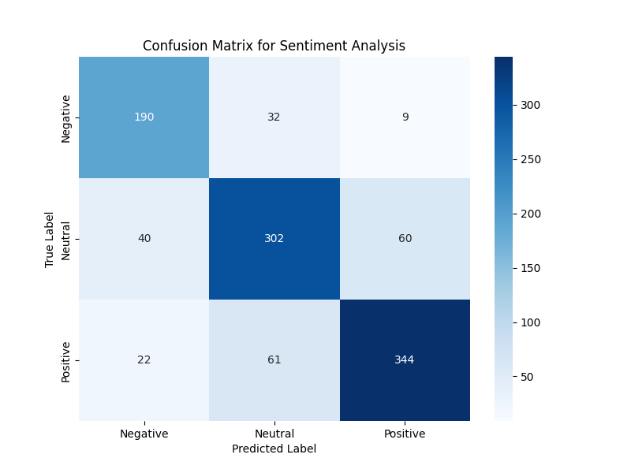
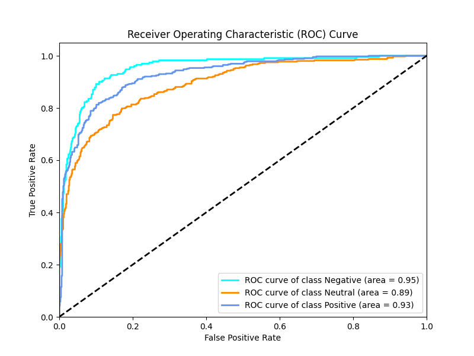
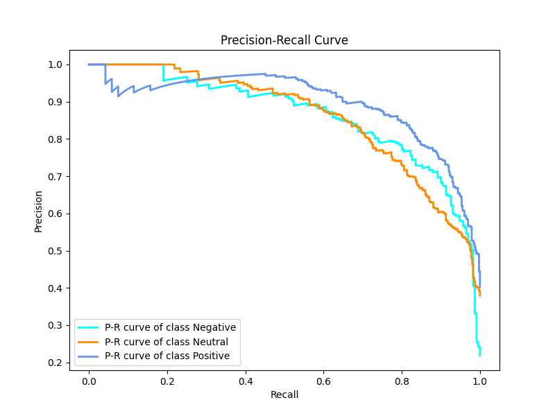
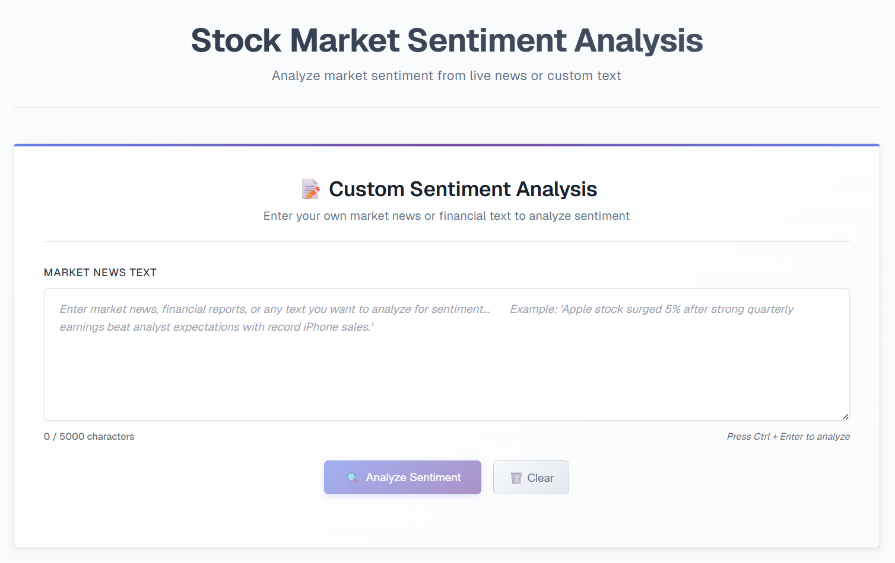

# Stock Market Sentiment Analysis

This project uses a BERT-based machine learning model trained on Indian news samples to predict sentiment related to the stock market. The model classifies news articles as **positive**, **negative**, or **neutral** to assist in understanding market sentiment.

## Getting Started

### Backend Setup (FastAPI)

1. Navigate to backend directory: `cd backend`
2. Install dependencies: `pip install -r requirements.txt`
3. Run the FastAPI server: `python main.py` or `uvicorn main:app --reload`
4. Server will start on `http://127.0.0.1:8000`

### Frontend Setup (Next.js)

1. Navigate to frontend directory: `cd frontend`
2. Install dependencies: `npm install`
3. Run the development server: `npm run dev`
4. Open `http://localhost:3000` in your browser

### Model Training

1. Navigate to model training directory: `cd model_training`
2. Install training dependencies: `pip install -r requirements.txt`
3. Prepare your dataset in the `data/` folder:
   - Place raw data in `data/data_raw.csv`
   - Run data encoding: `python data_encoder.py`
4. Train the model: `python trainer.py`
5. Evaluate model performance: `python model_valuation.py`
6. The trained model will be saved as `model/indianFinbert.pt`

## Results

### Model Performance

The trained BERT model shows strong performance on Indian financial news sentiment classification:

#### Key Metrics

- **Overall Accuracy**: 79%
- **Training Epochs**: 4 epochs with progressive improvement
- **Best Validation Accuracy**: 78.87%

#### Classification Report

```
              precision    recall  f1-score   support

    Negative       0.75      0.82      0.79       231
     Neutral       0.76      0.75      0.76       402
    Positive       0.83      0.81      0.82       427

    accuracy                           0.79      1060
   macro avg       0.78      0.79      0.79      1060
weighted avg       0.79      0.79      0.79      1060
```

#### Training Progress

- **Epoch 1**: Validation Accuracy 74.43%
- **Epoch 2**: Validation Accuracy 77.08%
- **Epoch 3**: Validation Accuracy 78.77%
- **Epoch 4**: Validation Accuracy 78.87% (Best)

#### Visual Results

##### Confusion Matrix



##### ROC Curve



##### Precision-Recall Curve



For detailed training metrics and results, see `model_training/training_result.txt`.

### Application Interface

#### Frontend Screenshots




### API Usage

```bash
curl --location 'http://127.0.0.1:8000/analyze' \
--header 'Content-Type: application/json' \
--data '{"text": "Your market news text here"}'
```

## Features

- BERT-based sentiment classification
- RESTful API for sentiment analysis
- Web-based chatbot interface
- Support for Indian market news context

## Disclaimer

This project is for **educational purposes only**. It does **not** constitute financial advice or legal guidance. Use the results at your own discretion.
